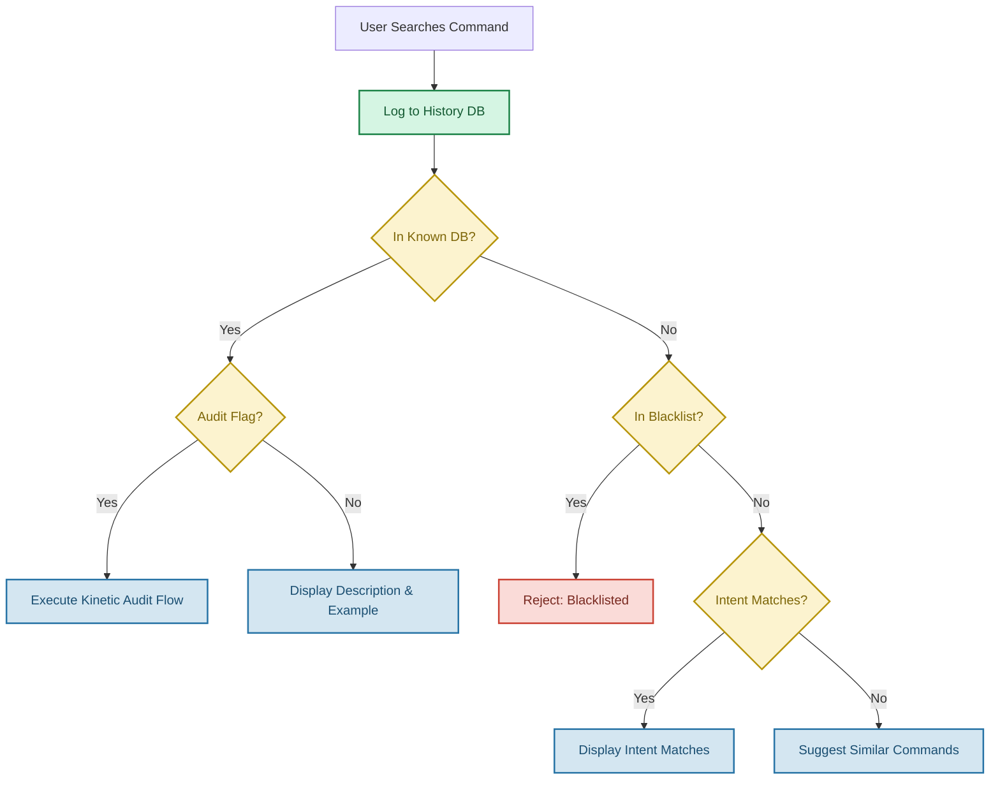
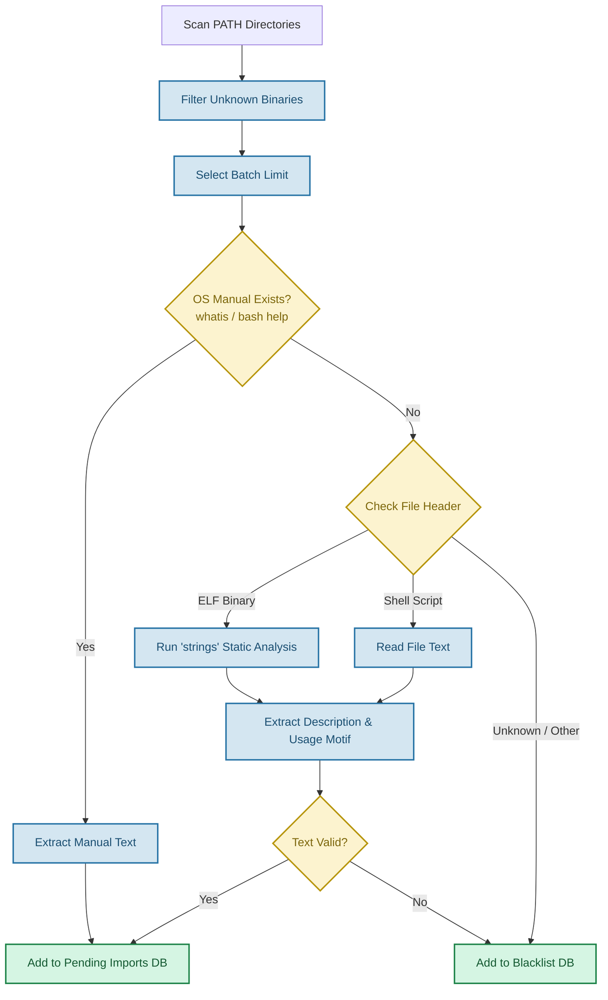
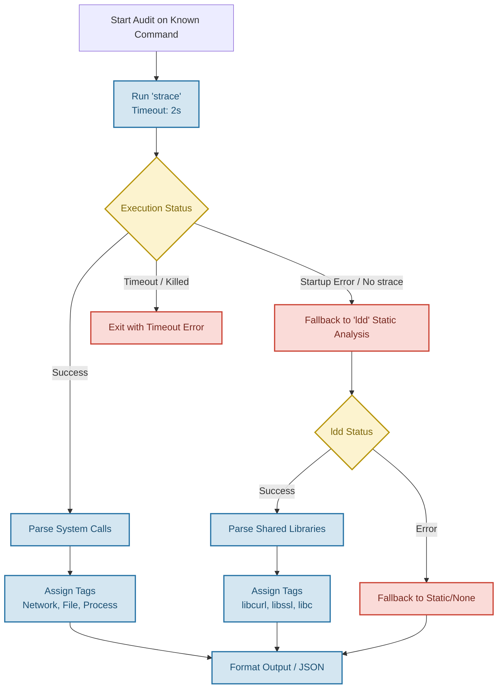

# CLI-Commando

**CLI-Commando** is your terminal command explorer and tutor. It learns the commands you actually use, mapping the CLI landscape dynamically, and providing helpful usage examples directly when you need them.

## Features

- **Interactive Dashboard:** Tracks command usage, custom definitions, and auto-imported descriptions.
- **System Auto-Scanner:** Defensively scans your system `PATH` for unknown executables using static analysis (safely examining ELF binaries and shell scripts without arbitrary execution) to build a robust local knowledge base.
- **Kinetic Auditing:** Profiles commands dynamically using `strace` to detect system calls (e.g., tagging network mutators or file readers), with graceful degradation to `ldd` static analysis when executed in restricted environments.
- **Bash Hook Integration:** Automatically hooks into your `command_not_found_handle` in bash to provide instant commando assistance.
- **Quizzes:** Run quick quizzes to test your knowledge of your own command history.


## Architecture

CLI-Commando transitions from dynamic probing to secure, defensive scanning:
- It safely extracts usage text from local binaries without running them.
- It employs concurrent execution carefully throttled to preserve system performance (especially on ARM and constrained hardware).
- It is designed as a fully modular Python package.

### Data Flow Diagrams

Below are the detailed workflows that power CLI-Commando. They share a consistent color coding scheme:
* **Blue**: Core processes and actions
* **Yellow**: Logical decisions
* **Green**: Data storage and databases
* **Red**: Fallbacks, errors, or rejections

#### 1. Overall Command Search Flow
How CLI-Commando handles a standard search query from the user.



#### 2. System Auto-Scanner Flow
The zero-trust containment protocol for discovering and learning about new executables safely without arbitrary execution.



#### 3. Kinetic Audit Flow
The dynamic behavioral profiling system with its graceful degradation into static analysis.



## Prerequisites & Environment

While the tool is installed via `pip`, it relies on the following OS-level binaries for its core functionality:
- **Strictly Required:** `strings` (used for safe static analysis of binaries).
- **Gracefully Degraded:**
  - `strace` (used for kinetic auditing; if unavailable or blocked by `ptrace` restrictions, falls back to static analysis).
  - `ldd` (used for static analysis fallback).
  - `whatis` (used to query known-safe system interfaces for command definitions).
  - `readelf` (used to securely examine ELF headers without execution).

**Termux** is explicitly recognized as a fully supported, first-class environment.

## Installation

For standard installation:

```bash
pip install .
```

For active development (editable mode):

```bash
pip install -e .
```

*(Note: Ensure your `~/.local/bin` or equivalent Python bin directory is in your system's `$PATH` for the OS to recognize the `commando` command globally).*

## Usage

Start the interactive terminal dashboard:

```bash
commando
```

Search for a specific command immediately:

```bash
commando search <command>
```

Run a kinetic audit to see exactly what an executable does under the hood:

```bash
commando search <command> --audit
```
